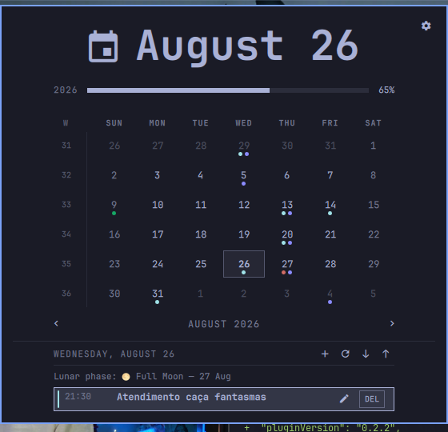
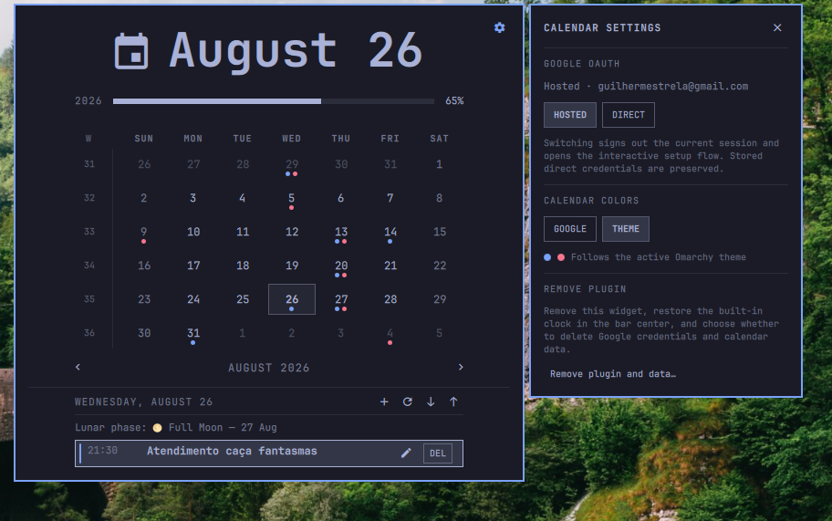

# Omarchy Google Calendar Clock Refresh

This community-maintained fork is based on the original
[Omarchy Google Calendar and Clock](https://github.com/NachoRodriguezM/omarchy-google-calendar-clock)
project. It adds bidirectional Google Calendar sync, event editing, lunar
phases, and interface refinements while preserving a local-first data model.

Repository: [guiestrela/omarchy-google-calendar-clock-refresh](https://github.com/guiestrela/omarchy-google-calendar-clock-refresh)

> Note: the repository is named `omarchy-google-calendar-clock-refresh`, while
> the Omarchy plugin ID is `io.github.guiestrela.omarchy-google-calendar-clock`.
> The local plugin path below uses the plugin ID, as defined in `manifest.json`.

An Omarchy bar clock with a local-first calendar. It reads standard `.ics`
files through [Caldir](https://github.com/t4t5/caldir), supports local event
creation and editing, and can pull from or push to Google Calendar on demand.

Calendar data and OAuth credentials stay in Caldir's local directories. The
plugin stores only an owner-readable derived event cache and includes no
telemetry.





## Requirements

- Omarchy with the Quattro plugin API
- An x86-64 or ARM64 Linux system
- Bash, Python 3, `curl`, `jq`, GNU `coreutils`, and `tar` (included with a
  standard Omarchy installation)
- A Google account for optional Google Calendar sync

The plugin downloads its own patched Caldir runtime; no Rust toolchain or
separate Caldir installation is required.

Each release includes one committed SHA-256 digest per architecture. Setup
verifies the downloaded archive against the digest in the installed plugin
checkout before extracting or executing it. The pinned Caldir source commit,
patch, and reproducible release workflow are kept in this repository.

## Data access and permissions

- No `sudo` or `pkexec` access is requested.
- Setup writes the downloaded Caldir runtime under
  `~/.local/share/io.github.guiestrela.omarchy-google-calendar-clock/`.
- Calendar data and Google OAuth credentials are managed under Caldir's XDG
  data and configuration directories.
- The derived event cache is written to
  `~/.local/state/omarchy/calendar-cache.json` with owner-only permissions.
- Direct OAuth talks to Google only. Hosted OAuth additionally sends OAuth
  tokens through `caldir.org`, as explained before that mode is selected.
- Setup changes the Omarchy bar only after the user explicitly runs it: it
  disables the built-in clock, enables this widget, and makes it the center
  anchor. The uninstaller restores the built-in clock and preserves unrelated
  bar changes.

## Install and set up

Add and enable the plugin with Omarchy:

```bash
omarchy plugin add https://github.com/guiestrela/omarchy-google-calendar-clock-refresh --enable
```

If an older installation is still present, remove it first with
`omarchy plugin remove omarchy-google-calendar-clock --yes`, then run the
installation command above. The renamed plugin uses the ID
`io.github.guiestrela.omarchy-google-calendar-clock`.

It initially behaves as a plain clock. Click it to open the calendar, then
select **Direct setup** or **Hosted setup**. The selected flow opens in a
terminal and guides you through the remaining steps.

You can run the same setup from a terminal:

```bash
~/.config/omarchy/plugins/io.github.guiestrela.omarchy-google-calendar-clock/setup          # Direct
~/.config/omarchy/plugins/io.github.guiestrela.omarchy-google-calendar-clock/setup --hosted # Hosted
```

After setup verifies the release, Google connection, and first calendar pull,
it disables the built-in clock, enables this widget, and anchors it at the
exact center of the top bar.

### Choose an OAuth mode

**Direct (default, recommended).** You create a Desktop OAuth client in your
own Google Cloud project. Authentication and token refreshes go directly
between your machine and Google.

**Hosted.** Caldir.org provides the OAuth relay, so no Google Cloud project is
needed. The trade-off is that sign-in and future token refreshes depend on
caldir.org, and OAuth tokens pass through its servers.

The setup flow explains the same choice before it proceeds. An existing OAuth
session is reused; it is not recreated on every setup run.

### Switch modes later

```bash
~/.config/omarchy/plugins/io.github.guiestrela.omarchy-google-calendar-clock/scripts/calendar-auth-mode switch hosted
~/.config/omarchy/plugins/io.github.guiestrela.omarchy-google-calendar-clock/scripts/calendar-auth-mode switch direct
```

Switching signs out the current session and starts the chosen sign-in flow.
Your direct OAuth client ID and secret are kept when switching modes. Check the
current mode with:

```bash
~/.config/omarchy/plugins/io.github.guiestrela.omarchy-google-calendar-clock/scripts/calendar-auth-mode status --json
```
You can see the chosen mode and switch from the settings panel too.

## Use

Click the clock to open the calendar. The toolbar lets you:

- create an event (`+`);
- synchronize with Google (`󰑐`);
- pull from Google (`↓`);
- push local changes to Google (`↑`);
- delete editable events with the `DEL` button.

New events are uploaded to Google automatically after they are saved locally.
Pull and push results remain visible for three seconds before the panel closes.

Lunar phases are added to the agenda as read-only events. When a day already
contains birthdays or manually-created events, the next lunar phase is shown
in the same event area as well.

The settings button can switch OAuth mode, choose Google or theme calendar
colors, and open the interactive full-uninstall flow.

The plugin reads its local cache immediately, refreshes in the background at
shell startup, and pulls every 30 minutes. The cache is stored at
`~/.local/state/omarchy/calendar-cache.json` with owner-only permissions.

## Personal modifications

- moved the popup to match Omarchy's native top-bar calendar behavior;
- added a sync icon and made the status action perform a Google pull;
- added three-second sync feedback followed by automatic panel closing;
- made event creation upload to Google automatically;
- added one-click deletion for editable events;
- added approximate new moon, first quarter, full moon, and last quarter
  events to the agenda;
- kept lunar events read-only and preserved read-only Google calendars;
- expanded `~/caldir` correctly so existing local Caldir calendars are found;
- improved hosted OAuth and local-installation error handling;
- added safer release-manifest, URL, and uninstall-path checks.

## Update

```bash
omarchy plugin update io.github.guiestrela.omarchy-google-calendar-clock
~/.config/omarchy/plugins/io.github.guiestrela.omarchy-google-calendar-clock/setup
```

Setup safely replaces the plugin runtime and reuses a valid existing OAuth
session.

## Remove

Prefer the plugin’s uninstaller to Omarchy’s Plugins menu
removal tool:

```bash
~/.config/omarchy/plugins/io.github.guiestrela.omarchy-google-calendar-clock/uninstall
```

It removes the plugin, its downloaded Caldir runtime, and its event cache. It
then restores the built-in `omarchy.clock` as the fixed center anchor of the
bar.

The uninstaller separately asks whether to delete Google OAuth credentials and
local Caldir calendar data. Keeping them allows a later reinstall to reuse
your calendar state. Pass `--yes` only after reviewing the script: it accepts
all removal prompts.

Using the removal hook in the Omarchy menu removes the plugin directory, but
leaves the data mentioned above and does not restore the built-in clock.

## License

MIT. See [LICENSE](LICENSE) and [NOTICE.md](NOTICE.md).
